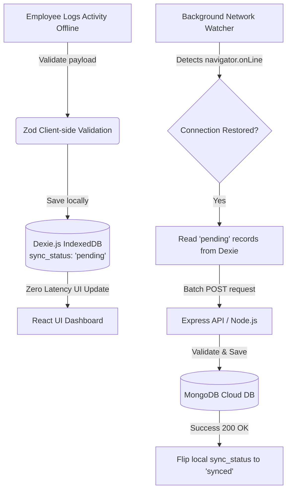

# 🌍 EcoSphere
### Local-First ESG Management & Gamification Platform

**An intelligent ESG tracking ecosystem powered by a zero-trust, offline-first sync architecture, automated carbon engine, and gamified employee engagement.**

---

## 📖 Overview

In modern business environments, tracking Environmental, Social, and Governance (ESG) metrics often relies on fragmented, error-prone manual spreadsheets. **EcoSphere** addresses this gap by integrating ESG tracking directly into daily business operations. It automates carbon calculations, monitors compliance, and implements gamification rules to boost employee sustainability participation.

The core technical innovation of EcoSphere is its **Zero-Trust, Local-First Architecture**. Designed for field and warehouse workers operating in network dead zones, the application caches all transactional activities locally in IndexedDB using Dexie.js and automatically syncs them securely to the central MongoDB cloud database once connectivity is restored.

---

## 🎯 Problem Statement

<table>
<tr>
<td width="33%">

### 📉 Environmental Friction
- Manual entry of fuel logs or utility bills leads to data errors.
- Lack of real-time visibility into overall departmental carbon footprints.
- Calculation delays due to manual emission factor mapping.

</td>
<td width="33%">

### 👥 Social & Engagement Gap
- Low employee motivation to participate in CSR activities.
- Fraudulent or unverifiable logging of social activities.
- Absence of structured gamification mechanisms (XP, badges, rewards).

</td>
<td width="33%">

### ⚖️ Governance & Compliance
- Compliance issues are assigned but forgotten.
- Missing active notification system for overdue violations.
- Lack of clear ownership and policy acknowledgment tracking.

</td>
</tr>
</table>

---

## 🛡️ Functional Modules

EcoSphere is structured around **three integrated core modules**:

 

### 1️⃣ Environmental Core – Automated Carbon Engine

> *Real-time carbon accounting and interactive dashboard visualization*

**Features:**
- **Automated Carbon Engine:** Watches operational inputs (e.g., Fleet fuel logs) and instantly computes CO₂ emissions using standard multipliers, removing manual estimation.
- **Dynamic ESG Dashboard:** Aggregates and displays the overall corporate ESG score calculated as a weighted average of Department Scores (Default: 40% Environmental, 30% Social, 30% Governance).

 

### 2️⃣ Social & Gamification Engine – CSR & Rewards

> *Empowering sustainable actions via verified evidence and gamified rewards*

**Features:**
- **Strict Evidence Portal:** Enforces participation verification by locking the "Submit" button until a valid proof file (image/document) is uploaded.
- **Automated Badges & Rewards:** Auto-awards badges based on XP milestones without admin intervention. Includes a Reward Redemption Catalog to trade XP for rewards.

 

### 3️⃣ Governance & Compliance – Active Issue Tracking

> *Ensuring corporate compliance through active accountability and tracking*

**Features:**
- **Active Compliance Flags:** Monitors open governance violations and alerts stakeholders automatically when issues exceed their due date.
- **Accountability Mapping:** Every issue requires a designated owner, status (`Open`/`Closed`), and a strict target due date.

---

## 🔄 Offline-First Sync Architecture

EcoSphere completely decouples the user interface from the cloud database to enable 100% offline capability.

1. **Local Writes:** User transactions are validated locally using **Zod** schemas and written to IndexedDB.
2. **Pending Queue:** Saved transactions are flagged as `sync_status: 'pending'` and carry client-generated unique IDs.
3. **Connectivity Sync:** The Network Watcher listens to connection state shifts, batches outstanding transactions, and streams them to the server.
4. **Conflict Resolution:** Upon receiving `200 OK` from the server, client records are flipped to `sync_status: 'synced'`.

---

## 👤 User Roles

<table>
<tr>
<td width="33%">

### ⚙️ System Admin
- Manages Department hierarchy
- Configures master **Emission Factors**
- Defines XP values and Gamification catalog

</td>
<td width="33%">

### 👔 Department Head
- Monitors aggregate department ESG score
- Audits localized compliance violations
- Oversees CSR participation reports

</td>
<td width="33%">

### 👷 Employee
- Logs offline CSR & fleet activities
- Uploads required proof of participation
- Earns XP, unlocks badges, & redeems rewards

</td>
</tr>
</table>

---

## 🔧 Technical Stack

| Layer | Technology | Description |
|-------|-----------|-------------|
| **Frontend UI** | React.js (Vite) | High performance SPA builder with hot-reloading |
| **Styling** | Tailwind CSS | Utility-first CSS framework for fast styling |
| **Local Database** | Dexie.js | Promises-based IndexedDB wrapper enabling live reactive queries |
| **Data Validation** | Zod | Unified client-server schema definition and validation library |
| **Backend API** | Node.js + Express | REST API for handling data sync and master configurations |
| **Cloud Database** | MongoDB | Highly scalable document store for master and transaction records |

---

## 📊 Unified Database Schemas

### Master Data (Synced Downward to Dexie on Load)
- **`departments`**: `id`, `name`, `headId`, `employeeCount`, `esgScores` `{env, soc, gov}`
- **`users`**: `id`, `name`, `departmentId`, `role`, `totalXP`, `badges` `[string]`
- **`emission_factors`**: `id`, `sourceType`, `multiplierValue`
- **`challenges`**: `id`, `title`, `xpValue`, `status`

### Transactional Data (Logged Client-Side, Synced Upward)
- **`carbon_transactions`**: `id`, `sourceType`, `rawAmount`, `calculatedEmissions`, `date`, `sync_status`
- **`csr_participations`**: `id`, `userId`, `challengeId`, `proofFile` (Base64), `status`, `sync_status`
- **`compliance_issues`**: `id`, `description`, `ownerId`, `dueDate`, `status`, `sync_status`

---

## 🔐 Privacy, Quota & Security

- **Payload Optimization:** Evidence images are optimized/resized on the client before being converted to Base64 to prevent IndexedDB storage bloat.
- **Client UUID Generation:** Database transactions use client-side unique identifiers (`crypto.randomUUID()`) to prevent MongoDB write collisions and support offline idempotency.
- **Validation Guardrails:** Shared schemas prevent incorrect or malicious data injections during bulk sync batches.

---

## 👥 Team Members

| Name | GitHub | LinkedIn |
|------|--------|----------|
| **Jatin Joshi** | [@JatinJoshi07](https://github.com/JatinJoshi07) | [LinkedIn](https://www.linkedin.com/in/jatin-joshi9527/) |
| **Rudra Suthar** | [@RudraSuthar-web](https://github.com/rudrasuthar-web) | [LinkedIn](https://www.linkedin.com/in/rudra-suthar-a77878316/) |
| **Yagnik Joshi** | [@yagnikjoshi](https://github.com/yagnikjoshi) | [LinkedIn](https://www.linkedin.com/in/yagnik-joshi-b1467a260/) |
| **Alis Gajera** | [@gajeraalish-coder](https://github.com/gajeraalish-coder) | [LinkedIn](https://linkedin.com) |

---

## 📝 Project Commit History

| Commit ID | Date | Author | Description |
|-----------|------|--------|-------------|
| `ce64ef3` | 12/07/2026 | Jatin Joshi | Initial commit |
| `3788ceb` | 12/07/2026 | Jatin Joshi | initial struct and setup |
| `` | 12/07/2026 | Rudra Suthar | Updated the readme.md |

---

**EcoSphere: Sustainable, resilient, and always active—even offline.**

